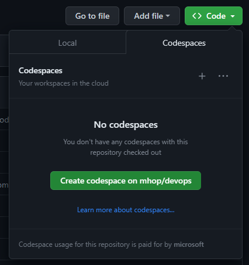
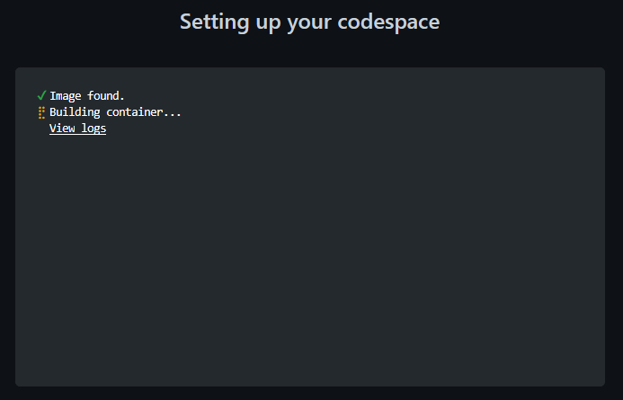

# Typechat
In this repo, we're exploring an approach to developer tools for generative ai prompt engineering.  The tools support a prompt flow pattern which converts each LLM output into a TypeScript or Python object, validated against a concise formal schema. The program can then work with this object by verfiying that it captures user intent, by matching the object to plug-in or library interfaces for further processing, and by converting the object into another LLM prompt.

In our experiences so far with building systems around LLMs, we have observed that:
1. LLMs can be constrained to avoid unexpected output formats if we specify the output form using a formal description such as a schema.
2. LLMs produce more consistent output if the prompt contains unambiguous, formal description of the possible outputs.
3. The approach of using formal schemas works best when the LLM has trained on many tokens from the given formal language.
4. For specifying schemas, some schema languages such as JSON Schema are more verbose (4-5X) than programming languages like TypeScript or simple schema languages like YAML schema  
5. Developers have requested a way to bridge between the approximate world of natural language chat and the precise world of software that takes actions on systems of record. Of course, the need for this bridge depends on the type of LLM application under development. For applications like search and draft generation, the system can remain in the approximate world because the human is in the loop selecting search results and reviewing draft edits.  For applications like updating a database, the bridge is an important step toward updating systems of record. Even for applications like search, the use of a schema increases reliability and simplifies processing.
6. Many developers will already have an informal or formal schema describing a program they would like to use to work with a chat output. For those with only an informal schema, we are working on a tool that uses LLM interaction to help the developer to craft a formal schema. Early versions of this tool are promising. In the restaurant and calendar app directories there are schemas that have the suffix ".gen.ts" and were created using LLMs.  These schemas are not the default but if used they will deliver high accuracy.

This repo supplies a method for implementing the first part the bridge: validating that the LLM output conforms to a schema that describes the instances that the system can work with.  Once the validity of an instance is established, the system using typechat must finish crossing the bridge by verifying that the valid instance corresponds to the end-user's actual intent. An application will choose a method for verifying intent that balances efficiency of execution with the potential harm of an incorrect change. 

To support validation, the developer creates a schema using a TypeScript type, a Relax NG compact schema or a YAML schema. The developer selects a root type from the schema that corresponds to the XML or JSON output requested of the LLM.  The developer describes in natural language the meaning of the root type (for example, a set of calendar update actions) and also the overall framing of the application (for example, a person is working with a bot to update a calendar).  

The developer can combine these inputs with end-user input to create a prompt that will result in the LLM generating a JSON or YAML instance. The typechat library validates the instance against the schema provided by the developer, simplifying the task of verifying that the captured end-user intent can be successfully processed by the system. The system can convert both JSON and YAML instances into objects native to the host programming language (TypeScript/JavaScript or python), simplifying post-processing.

## Alternative 1: Use GitHub CodeSpaces
In your web browser, navigate to the [repo on GitHub](https://github.com/microsoft/typechat/). Click the green button, labelled `<> Code` and then choose the `Codespaces` tab.
Then click the green `Create codespaces` button.



If this is your first time creating a codespace on this repo, 
GitHub will take a moment to create a dev container image for your session.



Once the image has been created, the browser will load a version
of VSCode, which has been configured to communicate with your dev container in the cloud.

Note that the dev container is pre-configured to clone the repo and run `npm run install` so you are ready to go as soon as VS Code appears in your browser.

Remember that you are running in the cloud, so all changes you make to the source tree must be committed and pushed before destroying the CodeSpace. GitHub accounts are usually configured to automatically delete CodeSpaces that have been inactive for 30 days.

For more information, see the [GitHub Codespaces Overview](https://docs.github.com/en/codespaces/overview)

## Alternative 2: Configure your Dev Machine
1. Install [Node.js (18.16.0 LTS or newer)](https://nodejs.org/en). Note that this version of node comes with `npm` package manager.
2. Clone the repo with `git clone https://github.com/microsoft/typechat.git`.
3. `cd` to the root of the repo.
4. Install packages with `npm install`.

## Build
```     
npm run build
```
This will build the library module and the apps.

## Environment Variables
Currently, the experiments are only running on Azure OpenAI endpoints.  To configure environment for this set the following variables:
| Variable | Value |
|----------|-------|
`OPENAI_API_KEY` | your API key
`OPENAI_API_BASE`| the base URL for your openai endpoint
`DEPLOYMENT_NAME`| the name of your Azure deployment

## Interactive Prompts
To run an example interactively, type `node [exampleName].js -i` in the example's directory and then enter a multi-line prompt. Enter a blank line to send the prompt and enter 'exit' on a line to end the session.

## Contributing

This project welcomes contributions and suggestions.  Most contributions require you to agree to a
Contributor License Agreement (CLA) declaring that you have the right to, and actually do, grant us
the rights to use your contribution. For details, visit https://cla.opensource.microsoft.com.

When you submit a pull request, a CLA bot will automatically determine whether you need to provide
a CLA and decorate the PR appropriately (e.g., status check, comment). Simply follow the instructions
provided by the bot. You will only need to do this once across all repos using our CLA.

This project has adopted the [Microsoft Open Source Code of Conduct](https://opensource.microsoft.com/codeofconduct/).
For more information see the [Code of Conduct FAQ](https://opensource.microsoft.com/codeofconduct/faq/) or
contact [opencode@microsoft.com](mailto:opencode@microsoft.com) with any additional questions or comments.

## Trademarks

This project may contain trademarks or logos for projects, products, or services. Authorized use of Microsoft 
trademarks or logos is subject to and must follow 
[Microsoft's Trademark & Brand Guidelines](https://www.microsoft.com/en-us/legal/intellectualproperty/trademarks/usage/general).
Use of Microsoft trademarks or logos in modified versions of this project must not cause confusion or imply Microsoft sponsorship.
Any use of third-party trademarks or logos are subject to those third-party's policies.
