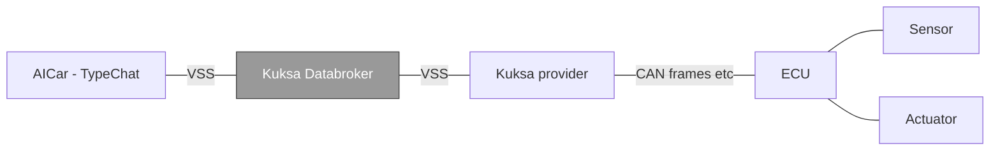

# aicar-zod
---
The goal of this example repo is to experiment with foundational AI tech (TypeChat) & models (GPT4O mini & PHI3 were tested) applied to in-car assistant scenarios.  The experiment approach is to utilize the real next generation of in-car standards (Kuksa, Covesa), augment those standards & frameworks with NL understanding tech powered by LLMs, to prove that the user experience can be improved with those technologies. 

[TypeChat](https://microsoft.github.io/TypeChat/) - provides a schema first framework to improve integration between NL understanding and LLM facilitated function calling

[Covesa VSS](https://covesa.global/) -
Covesa Vehicle Signal Specification provides a standard schema for vehicle communications. The [COVESA Vehicle Signal Specification](https://covesa.github.io/vehicle_signal_specification/) (VSS) defines the names and semantics of a large set of _data entries_ that represent the current and/or intended state of a vehicle's sensors and actuators organized in a tree-like structure. For example, the vehicle's current speed is represented by the `Vehicle.Speed` entry.
This standard has broad interest & support from key auto manufacturers and OEMs (BMW, Volvo, Bosch, Land Rover, etc.)

[Kuksa](https://projects.eclipse.org/projects/automotive.kuksa) -
Kuksa is a top level eclipse foundation project to define a software defined vehicle ecosystem based on a vehicle schema.  The VSS does not define how these signals are to be collected and managed within a vehicle, nor does it prescribe how other components in the vehicle can read or write signal values from and to the tree.  

Kuksa provides a standard databroker & GRPC interface to enable communication with vehicles.

**Kuksa Databroker** is a resource efficient implementation of the VSS signal tree and is intended to be run within a vehicle on a microprocessor based platform. It allows applications in the vehicle to interact with the vehicle's sensors and actuators using a uniform, high level gRPC API for querying signals, updating current and target values of sensors and actuators and getting notified about changes to signals of interest.

<!-- black box diagram -- inputs/outputs -->



At the right end, Kuksa providers implement the link between the Databroker and a vehicle's Electronic Control Units (ECU) to which the hardware sensors and actuators are physically attached.

Data is usually exchanged with ECUs by means of a CAN bus or Ethernet based protocols like SOME/IP. Providers translate between the low level messages used by these protocols and the Databroker's high level gRPC API calls to update a sensor's current reading or to forward a set-point value to an actuator via its controlling ECU.


### Features

- 100% Open Source (Apache 2.0 license)
- Written in Rust with an easy-to-use language agnostic gRPC interface
- Lightweight (<4 MB statically compiled), allowing it to run on even small vehicle computers  


## Setup and Environment Simulation 
---
### Databroker & Covesa
The simplest way to get an example Databroker and VSS schema for experimentation is to use the official Databroker container.  

> :memo: **Note:** The examples in this section do not use TLS nor access control. Please refer to the [Databroker User Guide](./doc/user_guide.md) for more sophisticated usage examples.

### Prerequisites

- [Docker Engine](https://docs.docker.com/engine/install/) or [Podman](https://podman.io/docs/installation)

### Starting Databroker

1. Start Databroker in a container attached to the host network on port 55556:

   ```sh
   docker run --rm -it -p 55556:55555 ghcr.io/eclipse-kuksa/kuksa-databroker:main --insecure --enable-databroker-v1
   ```

   > :bulb: **Tip:** You can stop the container using `ctrl-c`.

### AICar MVE
To test the sample in interactive mode, use the command line below.  This will leverage TypeChat to translate the natural language entered, translate it into the VSS scheme, and execute the GRPC call against the running databroker.
   ```sh
   node ./dist/main.js
   ```

### Android Auto Example App (not required)
The Kuksa Companion android application provides a visual interface to see the actions taken by the AICar assistant.  It is not required, but helps illustrate how the full system interacts with the databroker & the resulting car.
1.  Install Android Studio
2.  Start the Pixel android emulator
3.  Add the Kuksa Companion APK to the emulator
4.  Start the emulator & connect to the databroker

## Initial Test Results
---


## Next Steps & Investigations
---
